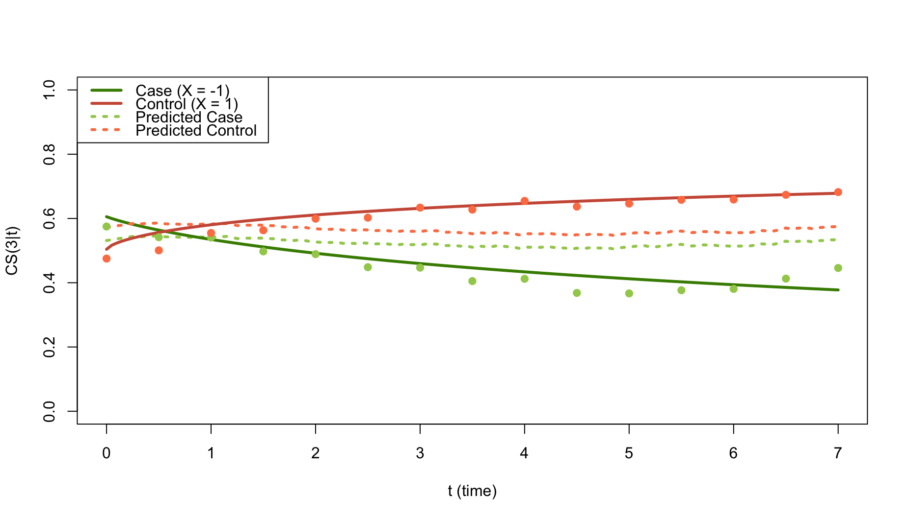
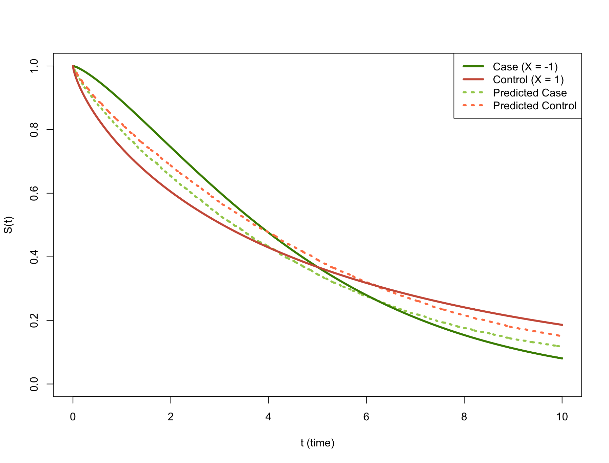
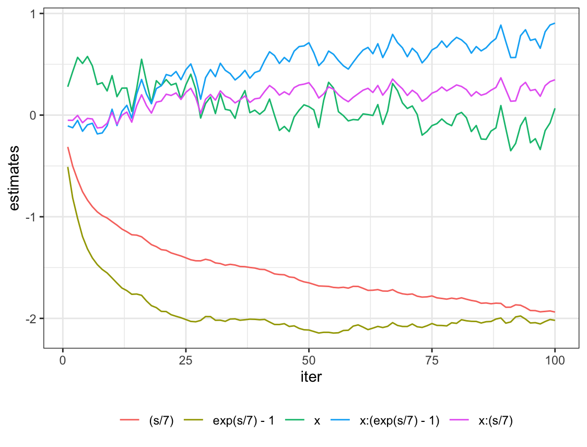
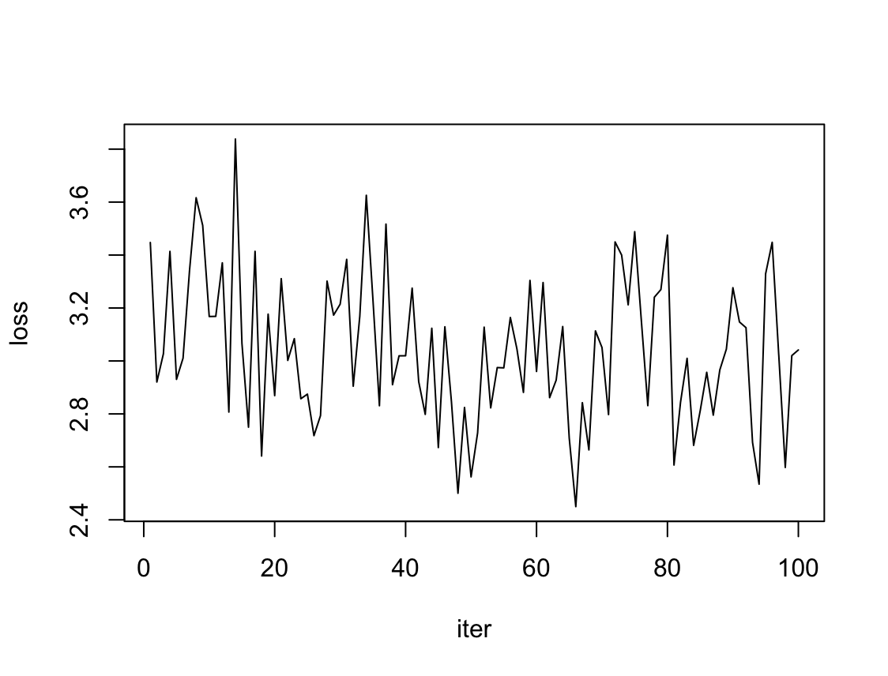
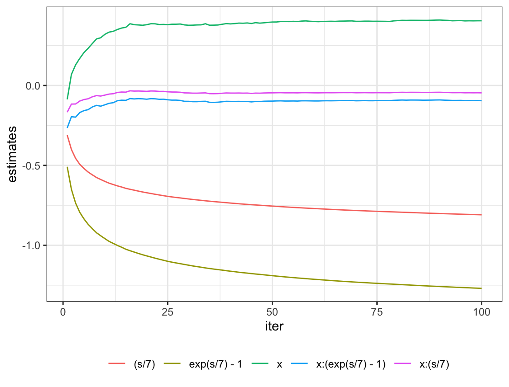
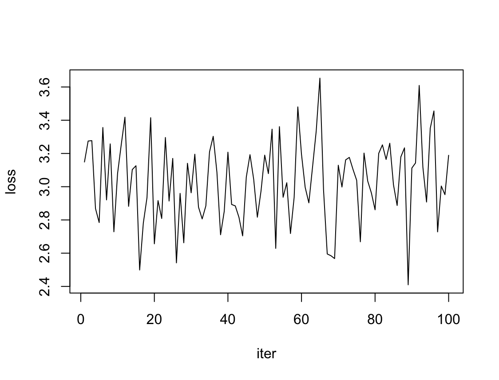

```{r setup, include=FALSE}
knitr::opts_chunk$set(echo = TRUE)
library(knitr)
library(kableExtra)
library(cowplot)
```

# Duke University Students Implement Dynamic Prediction Models for More Accurate Estimates of Survival

Durham, North Carolina - Today, Duke University students released their implementation of dynamic prediction for longitudinal data and time-to-event data, mainly aimed to help give clinicians more accurate estimates of clinical events. Longitudinal data record the same type of information on the same subjects at different points in time. A great example that is relevant to this product is Electronic Health Record (EHR) data generated from hospitals, which has patients’ medical histories with relevant clinical data at different time points. Time-to-event data are generated from studies that occur over time and measure the time it takes until a defined end point is reached. A relevant example is clinical trial data, where the endpoint of an observation could be death. These students hope that their implementation of dynamic prediction can support clinicians who may be conducting longitudinal or time-to-event studies to obtain more accurate estimates of the endpoints of interest, which can be events such as disease progression or death.

Typically, this type of data is modeled using the Cox proportional hazards regression, which can be used to investigate the association between various predictor variables and the time a specific endpoint of interest takes to happen. In a typical model, the parameters are assumed to be fixed as time goes on in the study. With dynamic prediction, the model parameters can vary. The benefit to this approach is that it may more accurately capture how the risk of a patient of having the event of interest changes over time. Say our event of interest in a long-term study is a disease that is known to be strongly associated with aging. As a patient ages throughout that study and measurements are taken, we would expect the risk of that patient developing this disease to increase. Dynamic prediction accounts for this relationship that the event of interest may have with measured or unmeasured predictors.

The Duke students have adapted this algorithm to deal with streaming data, meaning data that is generated continuously. The algorithm can incorporate new data as it is generated to update the dynamic model parameters and give new predictions. This is especially useful when patients are being followed over long periods of time and new measurements are taken. They are hoping this implementation can help clinicians obtain more accurate predictions of survival over time as patients come in to have measurements taken.

The students hope that dynamic prediction becomes a more widely adopted approach in studies modeling time-to-event data when the clinical features are changing longitudinally. Researchers and clinicians can utilize their algorithm in a scenario where the longitudinal data is generated in batches, which is often the case in a study where patients have measurements taken over time. From a bigger picture perspective, this streaming dynamic prediction modeling approach will hopefully help clinicians gain more accurate estimates of survival as new data comes in for their patients in a way that is computationally feasible. This will allow them to give updated medical advice based on the prognoses, which can hopefully improve a patient’s overall outcome.

As technology and statistical research advances in modern time, it is important that clinical studies and medicine as a whole incorporates these advances in a safe and responsible way. The decision to use a dynamic modeling approach for the prediction of an event as important as survival should be made by researchers and clinicians in tandem. A clinician’s understanding of covariates in the model is key to deciding whether or not they should be modeled in a time-varying fashion. A researcher or statistician should understand the assumptions that come with a dynamic modeling approach and how to carry out the study as new data comes in. The Duke students hope their algorithm can help both researchers and clinicians within this context to ultimately improve patient outcomes.


# Frequently Asked Questions

Here is a table for notations that may help to understand the FAQ and Technical Details.

```{r, echo=FALSE}
notations <- data.frame(
  Symbol = c("$s$", "$l \\in \\{1,2,...,L\\}$",
               "$w$",
               "$\\mathrm{CS}(w|s)$",
               "$R(t)$"),
  Meaning = c("landmark point", "landmark point index",
              "time window width",
              "conditional survial, $P(T \\ge w + s | T \\ge s)$",
              "risk set at $t$, $\\{i:t_i \\ge t\\}$")
)

kable(
  notations,
  format = "latex",
  escape = FALSE,
  align = "l",
  booktabs = TRUE,
  caption = "Notations"
) %>%
  kable_styling(position = "center", latex_options = "HOLD_position")
```

## What is a dynamic prediction model? How is it different from static models?

Dynamic prediction is a technique that predicts the risk of adverse events in the future within a given time window of a study. Typically, this approach is implemented within the framework of survival analysis. Mathematically, it involves predicting a conditional survival rate represented as $CS(w|s) = S(s+w|s)$. This model allows for measurements of predictors to be taken at any point within the time window, and it also allows for time-varying model parameters. This approach enables the assessment of the association between a patient's clinical features and the outcome of interest, while capturing the relationship between predictors and time [@li]. In other words, the "dynamic" aspect of this approach takes into account the dynamic behavior of predictors and their effects.

In contrast, static models are often used to predict a patient's survival following a diagnosis or treatment. However, these models require measurements to be taken at a fixed time, typically the baseline time, and they assume that model parameters remain constant under the proportional hazard assumption. As such, if the generative model of the data is complicated and contains longitudinal structure, using a static model may not be appropriate.

## What is a landmark model and what makes it dynamic?

A landmark model does not need to be dynamic. The concept was firstly introduced in @anderson as an alternative approach to the traditional Cox-PH model to properly handle time-dependent covariates. In its generalization, the method differs from the regular Cox model by modifying the original dataset. The optimization procedure to obtain estimates remains unchanged. There are two steps in engineering the new dataset: 1. subset the original data based on the landmark time $s$; 2. interpolate the time-varying covariate measured at the landmark point. As such, the analysis is only focused on patients who are still at risk at the landmark time. There are different ways to interpolate the covariate, and the simplest one is Last Observation Carried Forward (LOCF). The biggest advantage of this approach is that it is straightforward to be implemented based on the existing software packages, and the only engineering work is to create the landmark dataset. However, this analytic model is not dynamic, and we are limited to only answering the question of whether a covariate measured after the baseline has an effect on the survival after the landmark point.

@van2007 extended the landmarking technique by introducing a dynamic version that involves using a supermodel on a super dataset. In essence, this approach can be viewed as a combination of training a Cox model with data augmentation and incorporating feature engineering techniques into the model.

Let us discuss the creation of the super dataset. To begin with, a fine grid of equally spaced landmark times is selected, and a landmark dataset is generated for each of them. An additional step in generating these landmark datasets involves using a horizon time $t_{l, hor}$ for administrative censoring. This means that participants who have not experienced the event of interest by the horizon time are censored, so their data are included in the analysis up to the landmark time, but their subsequent follow-up time is not included in the analysis. Typically, horizon times are defined using a fixed time window $w$ such that $t_{hor}= s+w$. The super dataset is then created by stacking all the landmark datasets together and recording the landmark points as an additional column.

The supermodel, as the name implies, is simply a Cox regression based on the super dataset. The column for landmark points undergoes a continuous basis function and interacts with other predictors, allowing for their effects to be time-varying/dynamic. In the original derivation, the partial log-likelihood is integrated over the time interval $[0,t_{L,hor}]$, and the model is optimized over the integrated partial log-likelihood, hence the name IPL algorithm. However, another natural extension is made to separate landmark dependency from the base hazards, resulting in the IPL* algorithm. More detailed information about the formulation can be found in the Technical Details section.

## Are static models ever more appropriate? Does a dynamic model lose interpretability when compared to a static approach?

If your generative model is simple enough where the distribution of the covariates is time-constant, meaning they do not vary over time, a typical Cox regression would be more appropriate to use in predicting survival. A dynamic model does not necessarily lose interpretability in comparison to a static model, but it may be more difficult to explain. With a static model, we can directly use the model parameters as the measures of the predictors' effects. On the contrary, a dynamic model has a more complicated structure as we enable it to account for time-varying effects. To interpret it, we can visualize the parameters combined with the time interaction terms as functions of time.

## Why did you extend the current landmark (Integrated Partial Likelihood) IPL* algorithm to a streaming version?

A streaming version of the IPL* algorithm, similar to other streaming algorithms, allows the model parameters to be updated as new data comes in. With streaming, the data is coming in batches. This allows the algorithm to function in scenarios where new data is being generated over time for patients as they have measurements taken. The new measurements can be incorporated into the already existing model to update the parameters and give a new updated time-to-event prediction. The streaming algorithm also has the benefit of being memory efficient compared to a scenario where all of the data must be loaded in at once, as the data can now be loaded in batches as it comes in. This is especially useful in high-dimensional big data situations where there are many predictors measured for many patients in one study.

In addition, the landmark IPL* algorithm expands the original dataset by transforming it into the super dataset described above, with a finer grid for the landmark points This further raises the issue of limited memory, which necessitates a scalable version that can handle the big data challenge. Therefore, a natural extension for streaming big data is to combine Stochastic Gradient Descent (SGD) with IPL*.

## Can you give a scenario where this algorithm should be implemented?

This algorithm can be used in studies that generate longitudinal data from recurring clinical visits. It is best used when the longitudinal data contains time-varying covariates, which is often the case with many types of biomarker data. The streaming aspect of this algorithm allows it to function and update model parameters as new data is generated from the clinical visits. Predicting the time until an event of interest in scenarios where there are many time-varying covariates being measured for many different patients, which can typically be computationally intensive, is where this algorithm is most useful.

## Is there any competition or existing approaches for this streaming algorithm?

There is currently a streaming version of the proportional hazards Cox regression [@tarkhan]. This version was created to account for very large datasets, where a typical approach to Cox regression would be computationally very expensive. The streaming version allows data to be read in as different batches, with the model parameters being updated with each. This algorithm, while similar to ours, implements static prediction using Cox regression. For this reason, it is not a direct competitor to our algorithm, which is a streaming version of a dynamic prediction. 

# Technical Details & POC

## 1. Simple simulation to compare IPL* and standard cox model

Let's consider a generative model as follows.

$$
\begin{aligned}
    X_i &\sim \mathrm{Unif}\{-1, 1\} \\
    T_i &\sim S(t|X) = \exp\Big\{-\Big(\frac{t}{5}\Big)^{\exp(0.3X)}\Big\} \\
    C_i &= 10 \\
    \delta_i & = 1\{T_i < C_i\}
\end{aligned}
$$ 
This particular scenario does not allow for expressing $S(t|x)$ using the standard Cox-PH model, which assumes that $S(t|x) = \exp(-H_0(t)\exp(\beta x))$, where the value of $\beta$ remains constant over time.

We adopted this generative model design from @van2007 but present it differently. We compared the IPL* and standard Cox model in predicting $CS(3|s)$. The benefit of using this data generation design is that only a single dichotomous predictor is used so it becomes more straightforward to visualize the comparison for all possible values of the predictor. The survival function was deliberately designed so the predictor's effect was forced to be time-varying and violate the proportional hazard assumption.

In Figure \ref{fig1}, the predictions given by the standard Cox model are represented by dotted lines, while the predictions given by IPL* are represented by points. For this simple example, we only used two basis functions, $s/7$ and $exp(s/7) - 1$, in the IPL* algorithm. Although we also tried other combinations of scaled polynomials and $log(s/7 + 1)$ as the basis functions, the predictions were similar because the generative model was simple. The standard Cox model failed to capture the true CS curve, neglecting the curvature and tending to give constant estimates. This can also be observed in Figure \ref{fig2}, where we compare the predicted survival probabilities with the true values. The Cox model gave completely incorrect survival curves, and the predictions were close to the true values only at around $t = 6$.

{width=80%}

{width=60%}

The estimated model parameters are tabulated as follows.

```{r, echo=FALSE}
estimates <- data.frame(
  "-8.84", "2.17", "-0.30", "4.61", "-2.08"
)
kable(
  estimates,
  format = "latex",
  escape = FALSE,
  align = "c",
  booktabs = TRUE,
  col.names = c("(s/7)", "exp(s/7) - 1", "x", "x:(exp(s/7) - 1)", "x:(s/7)"),
  caption = "Model parameters from the IPL* algorithm."
) %>% 
  kable_styling(position = "center", latex_options = "HOLD_position")
```

## 2. Statistical modeling in the IPL* algorithm [@van2007; @van2011]

As stated in the FAQ, the supermodel is a Cox model that fits the super dataset and includes user-defined basis functions of landmark time and interaction terms with predictors. The model's parameters are optimized based on the integrated partial log-likelihood $ipl(\theta) = \int_{s_1}^{s_L + w} pl(\theta(s))\psi(s)ds$, which considers the time-varying effect of the predictor and the basis function. In practice, we set the basis function as $\psi(s) = \sum \gamma_j g_j(x)$, where $g_i(s_1) = 0$. Assuming $s_1 = 0$, then some good examples for $g_i(s)$ are polynomials, $\exp(s) - 1$, $\log(s + 1)$, etc.

We estimate the baseline hazard $h_0(t)$ using the @breslow estimator, but currently, the estimated baseline hazard $\hat{h}_0(t)$ is specific to the landmark time. To separate the influence of the landmark time on the estimates, we model the baseline hazard as $h_0(t|s) = h_0(t)\exp(\sum\eta_j g_j(s))$. By combining all these elements and discretizing the integrated partial log-likelihood with respect to landmark time, we obtain the formula for IPL*. The time-varying effect is appropriated by the basis function's elements.

$$
ipl^{*} =
    \sum_{i=1}^{n}d_i \log\Big\{
       \frac
       {\sum_{\{s: t_i \in [s,s+w]\}}\exp\big(x_i^{\top}\sum\gamma_j g_j(s)+\sum\eta_j g_j(s)\big)}
       {\sum_{\{s: t_i \in [s,s+w]\}}\sum_{j\in R(t_i)} \exp\big(x_i^{\top}\sum\gamma_j g_j(s)+\sum\eta_j g_j(s)\big)}
    \Big\}
$$
The corresponding Breslow-like estimator of $h_0(t_i)$ is given by

$$
\hat{h}_0(t_i) =
    \frac{\#\{s:t_i \in [s,s+w]\}}
    {\sum_{\{s: t_i \in [s,s+w]\}}\sum_{j\in R(t_i)} \exp\big(x_i^{\top}\sum\gamma_j g_j(s)+\sum\eta_j g_j(s)\big)}
$$
where $t_i \in [s_1, s_L + w]$. Finally, the predicted the cumulative hazard is obtained by $\hat{H}(t_{hor}|x,t_{LM}) = \hat H_0(t_{hor})\exp\big(x_i^{\top}\sum\hat\gamma_j g_j(s)+\sum\hat\eta_j g_j(s)\big)$ and $\forall t, \hat H_0(t) = \sum_{i:t_i \le t} \hat{h}_0(t_i)$.

## 3 . Implementation of the streaming algorithms

To clarify the procedure of generating the super dataset, we list the steps in Algorithm 1.

```{=tex}
\begin{algorithm}[H]
\DontPrintSemicolon
\SetAlgoLined
\SetKwInOut{Input}{Input}\SetKwInOut{Output}{Output}
\Input{raw dataset}
\Output{super dataset}
\BlankLine
1. Fix the prediction window $w$\;
2. Select a set of landmark points $\{s_1,...,s_L\}$\;
3. \For{$l \in \{1,...,L\}$}{
  Create a landmark dataset with $t_{LM} = s_l$ for truncation and $t_{hor} = s_l + w$ for administrative censoring\;
}
4. Stack the landmark datasets together\;
\caption{Generating landmark datasets for the IPL* algorithm}
\end{algorithm}
```

```{=tex}
\begin{algorithm}[H]
\DontPrintSemicolon
\SetAlgoLined
\SetKwInOut{Input}{Input}\SetKwInOut{Output}{Output}
\Input{Initial guess on the parameters}
\Output{$\hat\beta$}
\BlankLine
\kwInit{\;batch size $n_b$\; learning rate $\alpha_b$\; basis function $g(x)$\; $\hat\beta^{(0)} = 0$\;}
\BlankLine
\For{$b \in \{1,...,B\}$}{
  1. Select a mini-batch $C_b$\;
  2. Create super dataset for $\mathcal{S}_b$ using Algorithm 1\;
  3. Update the estimate $\hat\beta^{(b)}$ by 
  $\hat{\beta}^{(b)} = \hat{\beta}^{(b-1)} - \alpha_{b-1} \frac{\partial}{\partial\beta}(-ipl*)$\;
}
\caption{Streaming IPL* algorithm}
\end{algorithm}
```

It is worth noting that the coefficients for basis functions, predictors, and interaction terms are all included in the vector $\beta$. If we treat all the basis function and interaction terms as additional columns in the predictor matrix, the gradient will have the same form as the one for a standard Cox regression's partial log-likelihood.

## 4. Streaming performance
### Constant learning rate: $\alpha_b = 0.002$
{width=50%}{width=50%}
The left plot depicts the different beta estimates of the model over each iteration of the streaming algorithm with a constant learning rate. The right plot is the loss of the model plotted over the same iterations. In the estimates plot, the beta coefficients do not appear to be converging as more batches of data are read in to update the parameters. We can also see in the loss plot that there appears to be failure of convergence in the model loss even after 100 iterations of the algorithm.

### Adaptive learning rate: $\alpha_b = \max\{\frac{0.002}{b}, 10^{-5}\}$

{width=50%}{width=50%}

The left plot depicts the different beta estimates of the model over each iteration of the streaming algorithm with an adaptive learning rate. The right plot is the loss of the model plotted over the same iterations. In the estimates plot, the beta coefficients appear to be converging, which we would expect with an adaptive learning rate that decreases as more batches of data are read in to update the parameters. However, we can see in the loss plot that there appears to be failure of convergence in the model loss even after 100 iterations of the algorithm.

# Reference {-}


